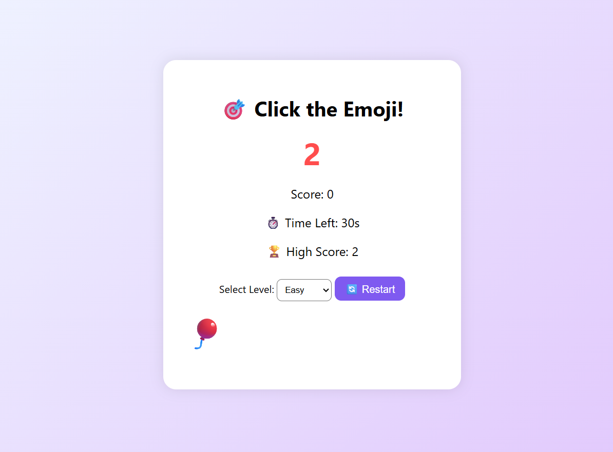

# 🎯 Emoji Click Game

A fun, animated, and responsive browser game built using **HTML**, **CSS**, and **JavaScript**. Click the moving emoji as many times as you can before the timer runs out!

---

## 🕹️ Features

- ⏱️ Countdown timer and animated game start
- 🎭 Random emoji with every move
- 🚀 Responsive layout for all screen sizes
- 🧠 Three difficulty levels: Easy, Medium, Hard
- 🔁 Restart button to replay instantly
- 🔊 Sound effects (click & game over)
- 🏆 High score saved in browser using `localStorage`

---

## 📁 Project Structure

emoji-click-game/

│

├── index.html # Main HTML file

├── style.css # Game styles

├── script.js # Game logic

├── click.mp3 # Click sound effect

├── game-over.mp3 # Game over sound effect

└── README.md # This file

---

## 🚀 How to Play

1. Open `index.html` in any modern browser.
2. Select your difficulty level.
3. A countdown (3...2...1) will begin.
4. Click the emoji before it disappears and moves!
5. Try to beat your high score before time runs out.

---

## 🛠️ Tech Stack

- **HTML5**
- **CSS3**
- **Vanilla JavaScript**
- **Pixabay Sound Effects**

---

## 🔉 Sound Credits

- [Mouse Click](https://pixabay.com/sound-effects/mouse-clicks-mouse-double-clicks-1705/)
- [Game Over](https://pixabay.com/sound-effects/game-over-21369/)

Licensed under Pixabay’s royalty-free sound license.

---

## 📸 Screenshot

---

## 🙌 Contributions

Pull requests are welcome! Feel free to fork the repo and improve features like:
- Scoreboard persistence
- Multiplayer support
- New emoji packs
- Dark mode

---

## 📄 License

This project is open-source and available under the [MIT License](https://opensource.org/licenses/MIT).
