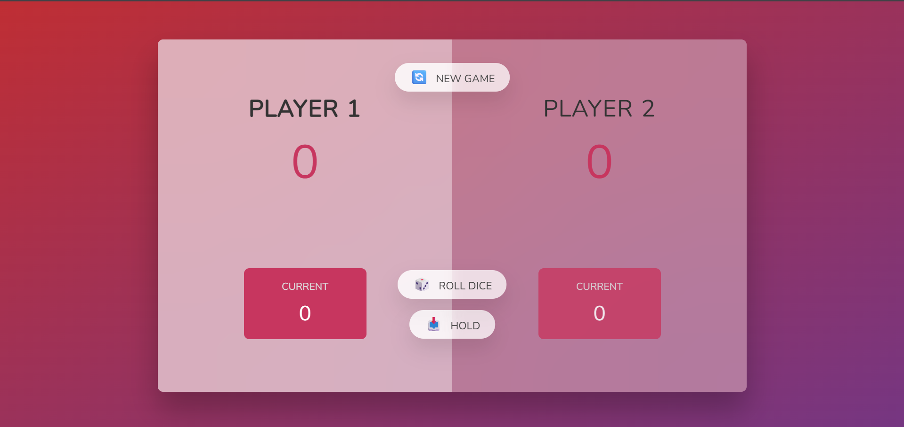

# 🎲 Pig Game

A fun, interactive two-player dice game built using HTML, CSS, and JavaScript. The objective of the game is to be the first player to reach 100 points!

## 🕹️ How to Play

- Two players take turns rolling a die.
- Each roll adds to the player’s **current score**.
- If a player rolls a **1**, their turn ends and their **current score resets to 0**.
- A player can **"Hold"** to add their current score to their **total score** and end their turn.
- The first player to reach **100 points** wins the game!

## 📁 Project Structure

pig-game/
├── index.html # HTML structure
├── style.css # Game styling
├── script.js # Game logic
└── README.md # Project documentation

## 🚀 Features

- Dynamic score updates
- Turn-based logic
- Win condition check
- New game reset button
- Clean UI with CSS styling

## 🛠️ Technologies Used

- HTML
- CSS
- JavaScript (Vanilla)

## 📸 Screenshot

> You can replace the screenshot link with an actual image file if hosting on GitHub or your personal portfolio.

## 🧠 Learnings

- DOM manipulation
- Event handling in JavaScript
- Game state management
- Responsive and interactive UI design

## 🧑‍💻 Author

- PrathmR
## 📃 License

This project is open source and available under the [MIT License](LICENSE).

